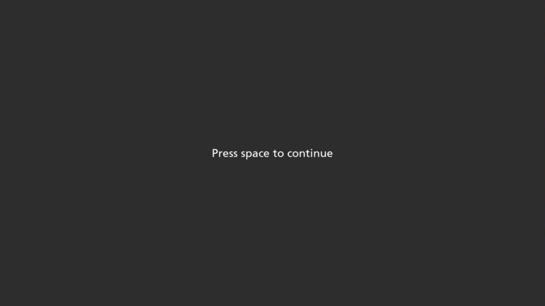

# TOJ_Extension

TOJ_Extension is an experiment program for a study ([Redden, d'Entremont, & Klein, 2017b](https://doi.org/10.3758/s13414-017-1290-0)) that explored whether endogenous (i.e. self-directed) spatial attention can cause a prior entry effect (i.e. alter our conscious perception of the order that stimuli appear) within the context of a temporal order judgement (TOJ) task.



On most trials of this experiment, participants are asked to judge which of two lines (one vertical, one horizontal) appeared first (or second) on the screen. On the rest of the trials, a colour dot appears briefly at one of the two target locations, and participants are asked to indicate what the colour was on a colour wheel. For one of the two experimental blocks, participants are informed that the colour dot will appear more often on the left than the right, and are told the inverse for the other experimental block.

## Requirements

TOJ_Extension is programmed in Python 2.7 using the [KLibs framework](https://github.com/a-hurst/klibs). It has been developed and tested on macOS (10.9 through 10.13), but should also work with minimal hassle on computers running [Ubuntu](https://www.ubuntu.com/download/desktop) or [Debian](https://www.debian.org/distrib/) Linux. It is not currently compatible with any version of Windows, nor will it run under the [Windows Subsystem for Linux](https://msdn.microsoft.com/en-us/commandline/wsl/install_guide).

## Getting Started

### Installation

First, you will need to install the KLibs framework by following the instructions [here](https://github.com/a-hurst/klibs).

Then, you can then download and install the experiment program with the following commands (replacing `~/Downloads` with the path to the folder where you would like to put the program folder):

```
cd ~/Downloads
git clone https://github.com/TheKleinLab/TOJ_Extension.git
```

### Running the Experiment

TOJ_Extension is a KLibs experiment, meaning that it is run using the `klibs` command at the terminal (running the 'experiment.py' file using Python directly will not work).

To run the experiment, navigate to the TOJ_Extension folder in Terminal and run `klibs run [screensize]`,
replacing `[screensize]` with the diagonal size of your display in inches (e.g. `klibs run 24` for a 24-inch monitor). If you just want to test the program out for yourself and skip demographics collection, you can add the `-d` flag to the end of the command to launch the experiment in development mode.

#### Optional Settings

The experiment program allows you to choose whether participants should be asked to judge which shape was **first** or which shape was **second**. To specify which condition to run, launch the experiment with the `--condition` or `-c` flag, followed by `first` or `second`. For example, if you wanted to run the experiment asking which shape was second on a computer with a 20-inch monitor, you would run 

```
klibs run 20 --condition second
```

If no condition is manually specified, the experiment program defaults to asking which shape was **first**.

Additionally, by default, responses in TOJ\_Extension are made using the '8' and '2' keys on the keyboard numpad. If you want to test out TOJ\_Extension on a computer that doesn't have a numpad (e.g. most laptops), you can open the experiment's parameters file (`ExpAssets/Config/TOJ_Extension_params.py`) and change the value of the variable `use_numpad` from 'True' to 'False'. This will map the TOJ response keys to the number row '8' and '2' instead.
